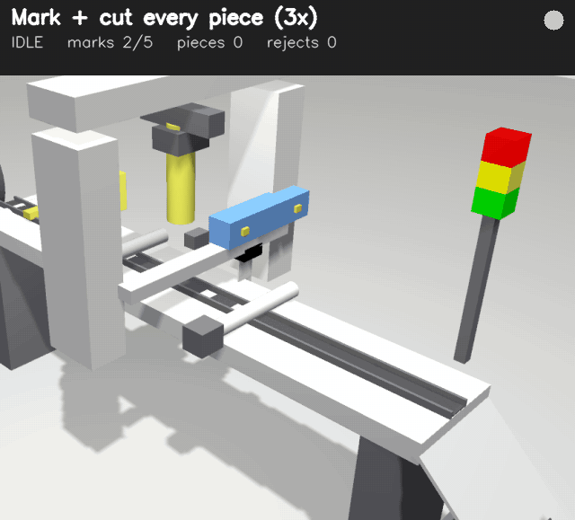
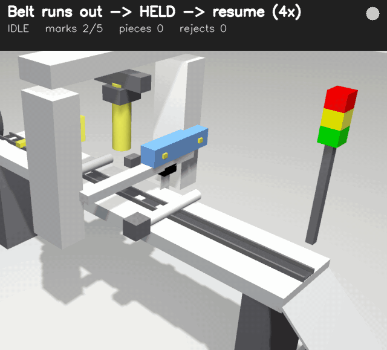
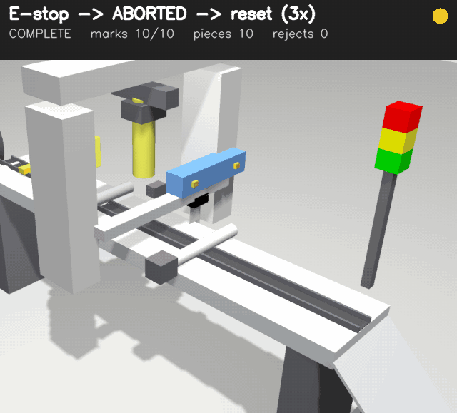
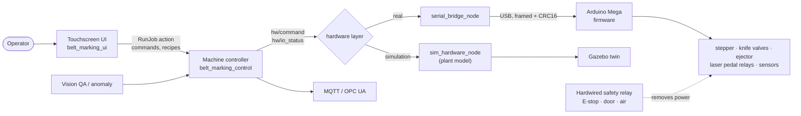
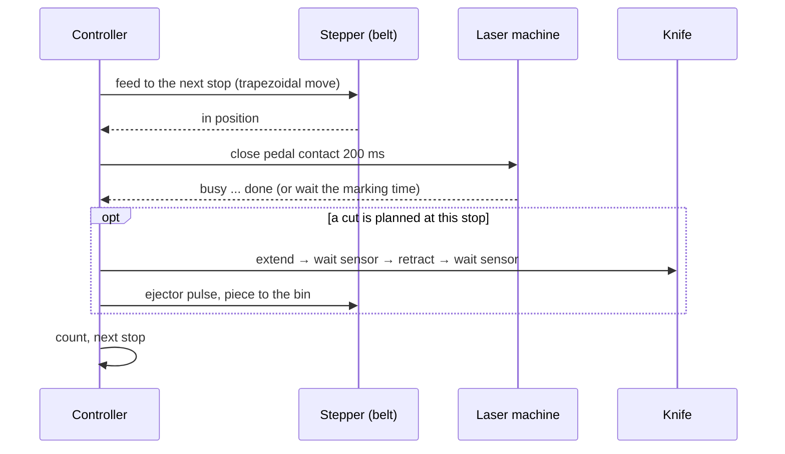
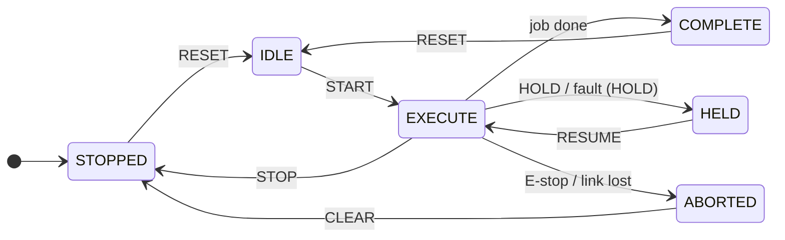
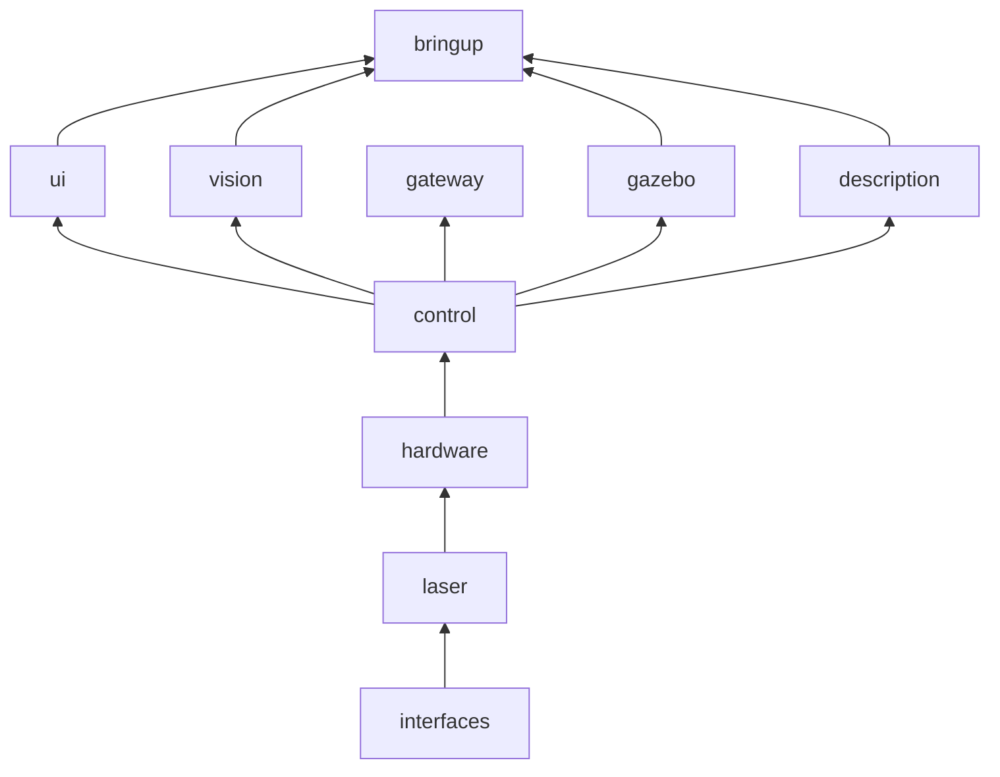
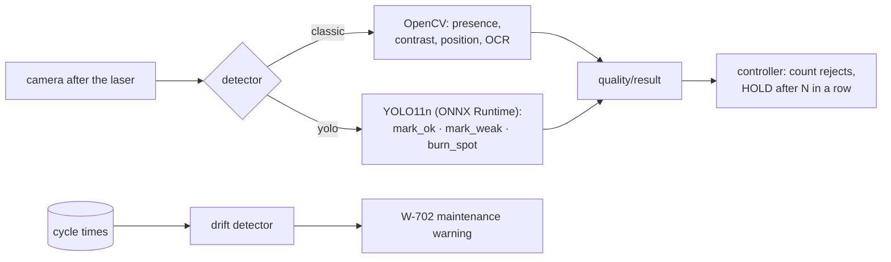
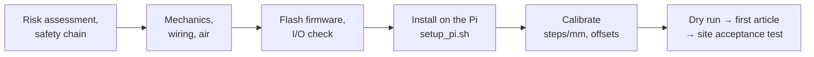

# Belt Marking Machine: ROS 2 control, Gazebo digital twin and laser integration

Control software for a machine that feeds a belt (or label tape), triggers one or more
laser marking machines, and cuts the belt into pieces with a pneumatic knife. It runs on
**ROS 2 Humble** on a Raspberry Pi with a touchscreen, uses an **Arduino Mega** for
real-time I/O, and includes a **Gazebo** simulation of the whole process.



*Normal production in the Gazebo simulation: the belt is fed, the laser marks each
label, the knife cuts it, and the piece drops onto the chute. The banner shows the live
machine state and counters.*

| Belt runs out → HELD → resume | E-stop during a cut → ABORTED → reset |
|---|---|
|  |  |
| E-401 at mark 3/10; after the refill the job continues to 10/10 without losing a count | everything stops (red); after release, CLEAR and RESET bring the machine back to IDLE |

<sub>Recorded from the running simulation with `tools/record_sim_gif.py` while
`demo_scenario 2 / 8 / 10` ran; fault phases play at real speed, the rest is 3–4× faster.</sub>

| Touchscreen UI (simulation running) | |
|---|---|
|  |  |

**Contents:** [What it does](#what-it-does) · [How it works](#how-it-works) ·
[Quick start](#quick-start) · [Scenarios](#scenarios) · [Repository](#repository) ·
[Engineering analysis](#engineering-analysis) · [AI and YOLO](#ai-and-yolo) ·
[Real machine](#running-the-real-machine) · [Documentation](#documentation)

> The laser in the installed machine is a **CO2** laser. It is used only through a
> trigger input and a busy/done signal (`LaserInterface`), so a fiber or UV laser works the
> same way.

## What it does

| Function | Detail |
|---|---|
| Job modes | continuous marking · cut every piece · cut every N labels · cut at end of batch |
| Lasers | up to 4 laser machines along the belt, each with offset and delay; the laser keeps its own design file; trigger = relay contact across the foot pedal |
| Laser completion | the laser's busy/done signal, or a fixed marking time; timeout alarms |
| Belt widths | recipes per belt type, checked against machine limits |
| Safety | hardwired E-stop / door / air chain; software only monitors and reacts |
| Faults | 23 coded alarms with a defined reaction (HOLD or ABORT) and a remedy text |
| Recovery | resume after laser timeout, knife fault or belt run-out without losing counts |
| Data | SQLite: recipes, jobs, production log, alarms, users, audit; OEE; CSV export |
| Operator UI | 800×480 touchscreen, PIN roles, English + Turkish |
| Simulation | the same software runs against a plant model and a Gazebo twin |
| Optional | vision QA (OpenCV or YOLO), drift detection, docs assistant, MQTT / OPC UA |

## How it works

### System



The controller never knows whether it drives the real machine or the simulation: both
hardware layers offer the same ROS service and topic (`hw/command`, `hw/io_status`).

### How one label is made



The planner converts a job into a sorted list of stops along the belt (positions in
mm). For pitch 60 mm and the knife 56 mm after the laser there are two stops per label:


### Machine states (PackML-based)



Transitional states (RESETTING, STARTING, HOLDING, …) are in [docs/STATE_MACHINE.md](docs/STATE_MACHINE.md).

## Quick start

**Docker** (Linux with X11, no ROS install needed):

```bash
git clone https://github.com/basheeraltawil/ros2-laser-marking-machine.git
cd ros2-laser-marking-machine
xhost +local:docker
docker compose -f docker/docker-compose.yml up --build sim       # Gazebo + RViz + UI
```

**Native** (Ubuntu 22.04 + ROS 2 Humble):

```bash
sudo apt install ros-humble-desktop ros-humble-ros-gz python3-pyqt5 python3-opencv
cd ros2_ws && rosdep install --from-paths src --ignore-src -y
colcon build && source install/setup.bash
ros2 launch belt_marking_bringup sim.launch.py                    # gazebo:=false for a light run
```

Then in the UI: **Login** → PIN `2222` (technician) → **Production → RESET** →
**Job setup** → **START**.

## Scenarios

Twelve scenarios: normal production (continuous, cut each, sets, two lasers, recipe
change), six faults (laser timeout, knife stuck, belt run-out, link lost, E-stop, weak
marks) and an 8-hour shift. Each scenario card in [docs/SCENARIOS.md](docs/SCENARIOS.md)
lists the terminal command, the UI steps, what you see, and what it proves.

```bash
ros2 run belt_marking_control demo_scenario 8      # live, with the simulation running
ros2 run belt_marking_control run_scenarios        # all 12 headless (~1 min incl. 8 h shift)
```

| Shift result (simulated, 8 h, 3 faults) | Value |
|---|---|
| labels produced | 10 498 |
| availability / performance / quality | 99.4 % / 94.2 % / 99.99 % |
| OEE | 93.6 % |

## Repository

```
ros2_ws/src/
  belt_marking_interfaces/   messages, services, RunJob action
  belt_marking_control/      state machine, job planner, alarms, database, OEE, scenarios
  belt_marking_hardware/     hardware abstraction, plant model, serial protocol, bridge
  belt_marking_laser/        LaserInterface: pedal-relay laser, simulated CO2 laser
  belt_marking_ui/           touchscreen operator UI (PyQt5)
  belt_marking_description/  parametric URDF/xacro model, RViz
  belt_marking_gazebo/       Gazebo world and digital-twin node
  belt_marking_vision/       vision QA (OpenCV / YOLO), drift detection, assistant
  belt_marking_gateway/      MQTT and OPC UA
  belt_marking_bringup/      launch files, machine.yaml (all settings in one file)
firmware/arduino_mega/       real-time I/O firmware (PlatformIO, unit tests)
analysis/                    engineering calculations with figures
raspberry_pi/                installation, auto-start, kiosk, backup
docker/  tools/  hardware/  docs/
```



A guided code tour (where a job travels through the code, how to add an alarm, a laser
type or a scenario) is in [docs/CODE_GUIDE.md](docs/CODE_GUIDE.md).

## Engineering analysis

[`analysis/`](analysis/README.md) has short scripts with the formulas behind the design,
and they reuse the machine's own code:

| Topic | Key result |
|---|---|
| Feed scale $s = 200\mu/(\pi D)$ | 69 steps/mm → 0.0145 mm/step; calibration $s_{new} = s_{old} L_{cmd}/L_{meas}$ |
| Motion | step-rate limit gives 58 mm/s; above 30 mm/s acceleration dominates short moves |
| Cycle time | model and simulation agree within 1.4–2.9 %; marking time dominates throughput |
| Layout | stations must be before the cut line: $x_i \le x_c - lead$ |
| Pneumatics | knife force $F = p\,\pi D^2/4$; air use per cut |
| OEE, drift | $OEE = A \cdot P \cdot Q$; a +20 % slower knife is flagged after 16–18 cycles |

## AI and YOLO

All AI parts are optional and outside the safety path; they report, the controller decides.



- **Vision QA:** checks every label with an OpenCV inspector or a YOLO11n detector
  trained on synthetic, auto-labelled images (`tools/yolo/train_mark_detector.py`, about
  5 min on a GPU). YOLO finds marks and burn spots; a measured contrast decides weak vs
  ok, because the network alone did not transfer that judgement to the Gazebo camera.
  Held-out synthetic accuracy is 98.0 % (classic 47.4 %). Details and limits are in
  [docs/AI_FEATURES.md](docs/AI_FEATURES.md).
- **Predictive maintenance:** robust drift detection on knife, laser and feed times.
- **Docs assistant:** offline answers from this documentation; read-only.
- **Natural-language jobs:** "200 pieces of 30 mm belt, cut each" fills the job form.

## Running the real machine



> ⚠️ Safety functions (E-stop, laser door interlock, air) must be hardwired through a
> safety relay and verified by a qualified person (ISO 12100, IEC 60204-1, ISO 13849-1,
> IEC 60825-1 for the class 4 laser). This software is not a certified safety system.

The laser is triggered by a relay **dry contact in parallel with its foot pedal**, with no
voltage connected to the laser controller. Values that must be measured on the machine are
listed in [docs/ASSUMPTIONS.md](docs/ASSUMPTIONS.md). The step-by-step checklist is
[docs/IMPLEMENTATION_GUIDE.md](docs/IMPLEMENTATION_GUIDE.md).

## Documentation

| Read this | For |
|---|---|
| [docs/README.md](docs/README.md) | documentation map |
| [ARCHITECTURE](docs/ARCHITECTURE.md) · [STATE_MACHINE](docs/STATE_MACHINE.md) · [SERIAL_PROTOCOL](docs/SERIAL_PROTOCOL.md) | software design |
| [CODE_GUIDE](docs/CODE_GUIDE.md) | reading and extending the code |
| [SCENARIOS](docs/SCENARIOS.md) · [analysis](analysis/README.md) | simulation, calculations |
| [ELECTRICAL](docs/ELECTRICAL.md) · [PNEUMATICS](docs/PNEUMATICS.md) · [MECHANICAL](docs/MECHANICAL.md) | hardware, BOM |
| [IMPLEMENTATION_GUIDE](docs/IMPLEMENTATION_GUIDE.md) · [OPERATOR_MANUAL](docs/OPERATOR_MANUAL.md) · [MAINTENANCE](docs/MAINTENANCE.md) | commissioning and operation |
| [AI_FEATURES](docs/AI_FEATURES.md) | vision, YOLO, drift detection, assistant |

**Tests:** `colcon test` (unit, 12 scenarios, ROS launch test, UI, lint) ·
`pio test -e native` (firmware) · GitHub Actions CI on every push.

## License and author

MIT, see [LICENSE](LICENSE). Basheer Al-Tawil, AIBO Mechatronics.
