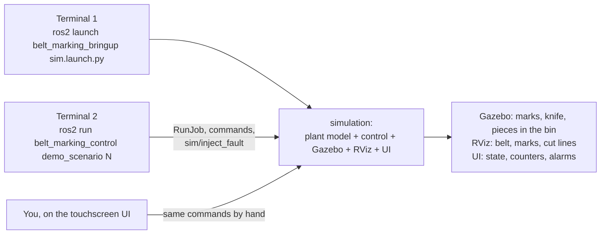
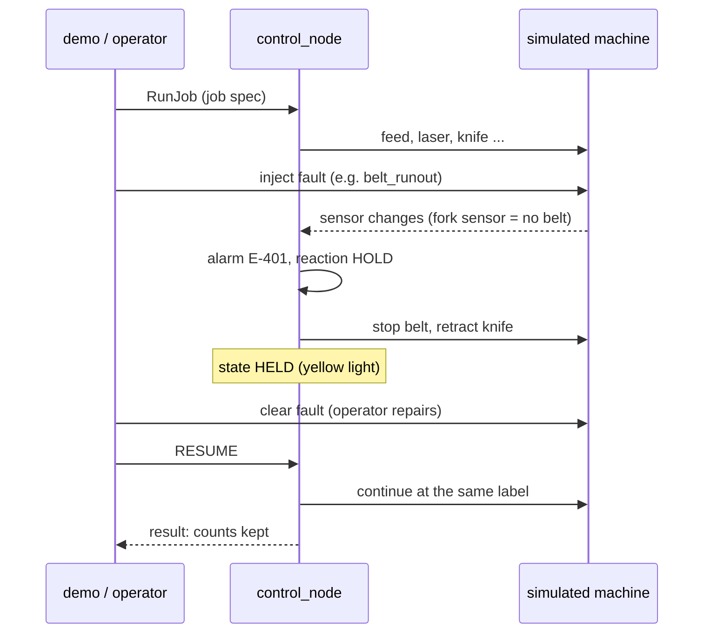

# Simulation scenarios

Twelve scenarios cover normal production and the faults that stop real marking lines.
Each one can be run in two ways:

| Way | Command | Use it to |
|---|---|---|
| **Live** (Gazebo + RViz + UI, real time) | `ros2 run belt_marking_control demo_scenario <N>` | watch and understand the behaviour |
| **Headless** (accelerated, self-checking) | `ros2 run belt_marking_control run_scenarios <N>` | verify; this runs in CI |



The demo prints `▶` for each step and `👀` for what to watch, and ends with **PASS/FAIL**.
Every step can also be done by hand. The UI login is technician PIN `2222`, and the faults
are buttons in **Settings → simulation**.

## Quick start

```bash
# Terminal 1 (inside the Docker image or a sourced workspace)
ros2 launch belt_marking_bringup sim.launch.py
# Terminal 2
source ros2_ws/install/setup.bash
ros2 run belt_marking_control demo_scenario 8       # e.g. belt runs out
```

`gazebo:=false` starts without Gazebo (faster; UI and RViz still show everything).
Scenario 4 needs `multi_laser_sim.launch.py` in terminal 1.

### Recording a GIF of a scenario

```bash
python3 tools/record_sim_gif.py --title "Belt runs out (4x)" --seconds 75 --speed 4 \
    --out docs/images/sim_belt_runout.gif &
ros2 run belt_marking_control demo_scenario 8
```

The recorder takes the Gazebo overview camera, adds a banner with state, counters and
alarm, and plays fault phases at real speed so the alarm can be read.

## How a fault scenario works



---

## Normal production

### 1 · Continuous marking (no cut)
- **Real-world use:** a roll of labels marked and rewound for later cutting.
- **Run:** `demo_scenario 1`. **UI:** Job setup → cut mode *Continuous*, 10 marks → START.
- **You see:** a light mark appears under the laser every 60 mm and moves towards the
  bin; the knife never moves; the *Marks* tile counts up; green light.
- **Result:** COMPLETE, every mark at k·60 mm (± 0.02 mm in the plant model), no cut.
- **Proves:** feed accuracy without accumulated error. The positions are computed
  from the job origin, not by adding moves.

### 2 · Cut every piece, fixed laser time
- **Real-world use:** single tags or labels; the laser has no done signal, so a time is used.
- **Run:** `demo_scenario 2`. **UI:** cut mode *Every piece*, laser done by *Time*.
- **You see:** mark → feed 46 mm → the knife crosses the belt → the piece slides into the bin.
- **Result:** 8 pieces; cut lines exactly on the label boundaries.
- **Proves:** mark-to-cut registration; the timed mode works without laser feedback.

### 3 · Sets of labels (cut every N)
- **Real-world use:** strips of 4 or 5 labels per customer or per product.
- **Run:** `demo_scenario 3`. **UI:** cut mode *Every N*, N = 4.
- **You see:** pieces of 4 labels each fall into the bin.
- **Result:** 3 pieces of 4 labels (the headless version also checks a short last set: 5,5,5,5,3).

### 4 · Two laser machines in sync
- **Real-world use:** text from one laser, logo or serial number from a second one.
- **Run:** terminal 1 `multi_laser_sim.launch.py`, then `demo_scenario 4`.
- **You see:** at each stop both laser heads raster. Station 1 marks the label 150 mm
  behind station 0, 0.3 s later.
- **Result:** every label marked by both stations at the same belt position.
- **Proves:** the planner's belt-coordinate model ([analysis §4](../analysis/README.md#4-layout-the-machines-workspace-layout_workspacepy)).

### 5 · Belt type change with recipes
- **Real-world use:** changeover between orders (20 mm and 50 mm belts).
- **Run:** `demo_scenario 5`. **UI:** Recipes → Load → START.
- **You see:** new recipes in the Recipes screen; the mark spacing changes 40 → 80 mm; a
  150 mm job is refused with "belt width must be between 10 and 100 mm".
- **Proves:** validation against machine limits before anything moves.

## Faults and recovery

| # | Fault (real cause) | Alarm → reaction | Operator recovery | Result |
|---|---|---|---|---|
| 6 | Laser never reports done (controller hung, job not loaded) | E-201 → HOLD | fix, RESUME → RETRY or REJECT | no label lost; REJECT counts 1 reject |
| 7 | Knife stuck half way (low air, blunt blade, bad seal) | E-301 → HOLD, knife retracted automatically | free knife, RESUME | every boundary cut exactly once |
| 8 | Belt runs out mid-batch | E-401 → HOLD | splice new belt, RESUME | counts kept across the refill |
| 9 | USB link to the controller lost | E-501 → ABORT; firmware stops within 0.5 s | reconnect, CLEAR, RESET | both sides safe; back to IDLE |
| 10 | E-stop pressed during a cut | E-101 → ABORT; CLEAR refused while pressed | release, CLEAR, RESET (knife retracts) | safe restart procedure works |
| 11 | Laser starts marking weakly (dirty lens) | W-601 per label, E-602 after 3 → HOLD | clean lens, RESUME | rejects counted, OEE quality drops |

For each: `demo_scenario <N>`, or by hand: start a job, press the fault button in
**Settings → simulation** (`laser_late`, `knife_stuck_extend`, `belt_runout`, `link_loss`,
`estop`, `laser_weak_mark`), watch the alarm bar and light tower, clear the fault, then
use RESUME, or CLEAR + RESET.

**What you see:** the state in the top bar changes EXECUTE → HOLDING → HELD (yellow), or
→ ABORTED (red); the alarm text and remedy appear in **Alarms**; in Gazebo the belt stops,
and for scenario 7 the knife returns. Scenario 11 needs `vision:=true` (the default): the
marks in Gazebo turn grey.

**Proves:** every stop is detected, the machine goes to a safe state, and production
continues without losing or duplicating labels.

## Long run

### 12 · Shift soak test with OEE
- **Real-world use:** estimate output and losses of a shift before buying or changing the line.
- **Run:** `ros2 run belt_marking_control run_scenarios 12 --hours 8`. It is
  accelerated: about 25 s for 8 hours. The live demo just prints this command.
- **What happens:** 200-label batches back to back, with 3 faults (laser late, belt
  run-out, knife stuck) and an operator who reacts after 1 minute.
- **Result (reference):** 53 batches, 10 498 labels, availability 99.4 %, performance
  94.2 %, quality 99.99 %, **OEE 93.6 %**.
- **Proves:** the system runs for a full shift without manual resets; OEE formulas in
  [analysis §6](../analysis/README.md#6-oee-and-drift-detection-oee_and_driftpy).

## Acceptance criteria (headless runner)

| # | Pass when |
|---|---|
| 1 | COMPLETE; 50 marks at k·60 mm ± 0.02; 0 cuts; no alarm |
| 2 | 100 cuts at (k+1)·30−5 mm ± 0.02; 100 pieces ejected |
| 3 | pieces of 5,5,5,5,3 labels |
| 4 | both stations mark all 12 labels at k·60 ± 0.02 |
| 5 | both recipes complete; 150 mm job refused |
| 6 | E-201 + HELD; belt still; 8 labels done; rejects 0 (retry) / 1 (reject) |
| 7 | E-301 + HELD; knife retracted; 6 pieces, each boundary cut once |
| 8 | E-401 + HELD; RESUME refused while no belt; 30/30 after refill |
| 9 | E-501 + ABORTED; firmware watchdog < 0.6 s; CLEAR + RESET → IDLE |
| 10 | E-101 + ABORTED; drive off; CLEAR refused while pressed; new job runs after reset |
| 11 | E-602 after 3 rejects; quality 17/20 |
| 12 | no ABORT for the whole duration; all faults recovered; availability > 90 % |

## Fault injection reference

`ros2 service call /sim/inject_fault belt_marking_interfaces/srv/InjectFault "{fault: <name>, enable: true, value: <v>}"`

| fault | value | effect |
|---|---|---|
| `laser_no_response` | – | laser ignores the pedal (→ E-203) |
| `laser_late` | extra seconds | job takes longer (→ E-201 if beyond the timeout) |
| `laser_weak_mark` | – | low-contrast marks (vision rejects) |
| `knife_stuck_extend` / `knife_stuck_retract` | – | cylinder stops half way (→ E-301 / E-302) |
| `belt_runout` | mm still seen by the fork sensor | belt tail (→ E-401) |
| `belt_slip` | slip ratio, e.g. 0.05 | encoder ≠ steps (→ E-402, encoder option) |
| `estop`, `door_open`, `low_air`, `driver_fault` | – | safety / monitor inputs |
| `link_loss` | – | USB unplugged |
| `clear_all` | – | remove all faults |

## On the real machine

The same list is the site acceptance test: provoke each fault physically (unplug the
busy wire, close a flow control, run a roll empty, unplug USB, press the E-stop, defocus
the laser). See [IMPLEMENTATION_GUIDE.md §10](IMPLEMENTATION_GUIDE.md#10-site-acceptance-test-sat).
